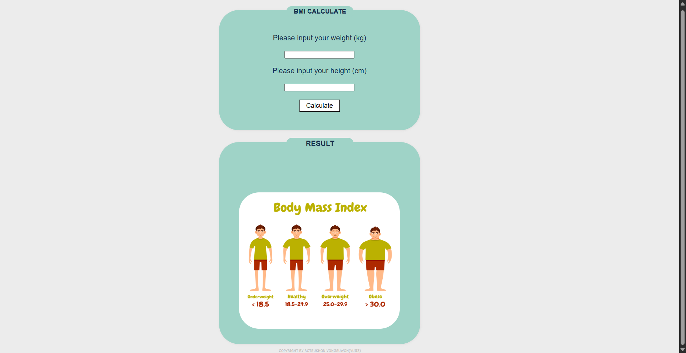
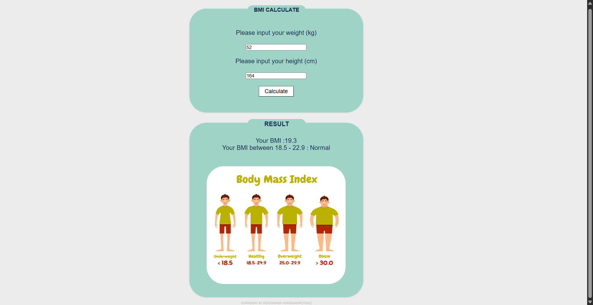

# BMI Calculator

A simple web application that calculates Body Mass Index (BMI) based on height and weight.

This project was created during the BorntoDev JavaScript Workshop to practice basic JavaScript, HTML, and CSS.

---

## 🌐 Live Demo
🔗 https://rotsukhonvongsuwon.github.io/bmi-calculator-js/

---

## ✨ Features
- Calculate BMI based on height and weight
- Display BMI category (Underweight, Normal, Overweight, Obese)
- Simple and responsive UI

---

## 🛠 Tech Stack
- HTML
- CSS
- JavaScript

---

## 📸 Screenshots

### BMI Calculator UI

### BMI Result

---

## 📚 Project Source
Created during **BorntoDev JavaScript Workshop**.
